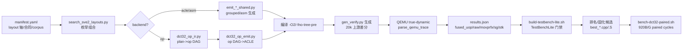

# 当前工具/流程梳理与强化方案（2026-08-13）

> 说明：本文档只描述“当前实际跑的流程”，不替代 docs/05 的原路线设计。
> 原设计仍保留；本文是后续“把实际流程优先化”讨论的基础。

## 1. 当前 DCT32 主流程（可执行工具链）

另有两条旁路：
- **search_plans.py**（rewrite 驱动）：spec plan → verify_layout → canonical key →
  lower() → 编译 → 20k 差分 → trace；与主搜索共用 QEMU/计数/门禁。
- **咨询旁路**：Agent 把上下文打包 → `codex -p sss`（GPT-5.6-sol）→
  `expert-advice/round-NNNN/*` → 人工/Agent 写 decision.md。

## 2. 每阶段输入/输出

| 阶段 | 输入 | 输出 |
| --- | --- | --- |
| manifest | kernel 名、布局轴、合同、corpus、baseline | 搜索空间（组合列表） |
| 发射器（acle/asm/op） | combo + 常量表/IDX | C++/S 源码 |
| op DAG | Plan（Tile/ConstantMap/MemoryMap/RoundBarrier） | 6800+ op，2048 store lane |
| op 发射器 | op DAG + 数据表 | ACLE 源码（不调用 grouped） |
| 编译 | 源码 + flags（op 用 -fno-tree-pre） | 候选 .o |
| 差分 | 候选 .o + 上游 oracle + 20k corpus | mismatches / rate |
| trace | 候选二进制 + 符号区间 | dynamic/vector/movprfx/fused_uop/sg/stk |
| lite 门禁 | 候选 .o + x265 MBDstHarness | PASS/FAIL（多 seed） |
| paired 测量 | 候选/上游二进制 + 样本数 | median + bootstrap CI |
| 咨询 | 上下文/结果/失败记录 | round-NNNN 建议 + decision.md |

## 3. 仍依赖 Agent 的部分（自动化缺口）

### 3.1 高度依赖 Agent（当前无工具）

1. **新搜索轴的发明**：zip 切片、row_group=8、legacy_ex/k4、常量预排列等，
   都是从内部直方图/失败分析里“人想出来”的；manifest 轴本身是手写的。
2. **op DAG/发射器的机制扩展**：新增一种结构（如合并窄化）要手写
   `dct32_op_ir.py` + `dct32_op_emit.py` 的 lowering/发射逻辑。
3. **失败→下一假设的推理**：例如“rshrnb 结果在偶 lane → 用 trn1 而不是
   zip1”这类结论靠探针+推理，没有自动化。
4. **合同裁定**：upstream-exact vs legacy-internal-exact 由用户/Agent 决策。
5. **跨 kernel 适配**：DCT16/interp8/sa8d16 的 OpIR 与轴都要重新设计。

### 3.2 半自动（有工具但需人介入）

- 探针编写（zip/trn/svlastb/EEO16 语义）是 ad hoc C++，不在 pipeline 内；
- LLVM-MCA 是手动调用，未接入排名；
- 实机 paired 需要人选 binary/参数并解读；
- 咨询结论的落盘（decision.md）需要 Agent 写。

### 3.3 已自动化

- 组合枚举、编译、20k 差分、true-dynamic 计数、lite 门禁、results.json 排名、
  canonical key、layout verifier、provenance 检查、回滚/负结果提交（过程纪律）。

## 4. 强化方案（按“让工具自动搜出优化算子”的目标排序）

### P0：op 级原子 rewrite 引擎（最高优先）
- 把已验证机制反哺成可枚举变换：`merge_narrow`（4→8 行窄化）、
  `tbl2zip`（TBL→zip/trn）、`split_rows`（row_group 1/4/8）、
  `const_prearrange`（CODD/K2S/K4S 预复制）、`accumulator_split`、
  `legacy_s16`（合同降级）。
- 每个 rewrite 带 legality/proof-obligation；搜索直接作用于 op DAG，
  不再需要“人先想到轴再写 emitter”。
- 验收：不给任何参考方向，仅用 spec plan + rewrite 库，能重发现在 6464。

**进度（2026-08-13）**：P0 增量 1 完成——`optimizer/ir/dct32_rewrites.py`
实现 `tbl2_to_zip` 原子 rewrite（按 pass/group 感知的链匹配 + 惰性 prep），
接入 `emit_from_plan`；rewrite 路径与手工 zip 变体计数完全一致
（row4 7938、row8-legacy 6464），20k 差分/TestBenchLite 均过。
`rewrites` 已接入搜索轴（manifest），op 搜索 48 候选 best=6464，
rewrite 组合同样可达 6464——结构空间搜索的第一维已闭环。
下一步 rewrite：`merge_narrow8`、`legacy_k2/k4`、`const_prearrange`。

**进度（2026-08-13）**：P0 inc3 完成——新增 `legacy_k2` 原子 rewrite
（pass2 k2 mul→EX sdot，自动补 EO16/EX，仅 row4）；rewrite 路径
20k 16 mismatch（legacy 签名）+ TestBenchLite PASS，fused 8046
（对照手工 legacy_ex=7966，差 ~1% 为调度微差）。已加入 rewrites
搜索轴。

**进度（2026-08-13）**：P0 inc4 完成——新增 `legacy_k4` 原子 rewrite
（两 pass k4 mul→EEO16 切片 + sdot，自动补 E16/EE16/EEO16 与 rev8）；
序列 `[legacy_k2, legacy_k4]` 可组合应用（fused 7617、raw 8065、
TestBenchLite PASS）。修复 op_id 跨 rewrite 冲突（counter 从输入
最大编号之后开始）。

**进度（2026-08-13）**：P0 inc5 前置完成——发射器改为从 op DAG 推导
`n_groups/row_group`（不再读 plan row_group flag），rewrite 只需重打
g 标签即可改变循环结构；推导后 row8 legacy 仍为 6464/6904（回归通过）。
`merge_narrow8`（双 bank 重排 + trn1 合并）作为下一步原子 rewrite。

**进度（2026-08-13）**：P0 inc5 完成（odd + k2-EX）——`merge_narrow8`
原子 rewrite：g 重打为 0..3、odd/k2-EX 按偶/奇行双 bank 重建、合并
`narrow8(trn1)+store8`；row4 上游 8283 → row8 上游 **7778**（-505），
20k=0、TestBenchLite PASS。限制：k4 legacy dot 链尚未重建（下一步）；
与计划级 row8（7686）差 ~1% 为调度微差。

### P1：跨 kernel OpIR/通用 MachineIR
- 把 dct32_op_ir 的 op 集（load/rev/unpk/permute/dot/mul-reduce/round/
  narrow/store）泛化；为 DCT16/interp8/sa8d16 建适配器，复用同一搜索。
- 每个新 kernel 自动生成：上游基线计数、halve_gate、候选排名。

### P1：成本模型/早期剪枝接入
- 把 LLVM-MCA（uops/RThroughput/依赖链）接入排名，作为 fused_uop 的
  第二代理；实机 paired cycles 回填校准（per-kernel 学习曲线）。
- 用 `check_isa_level.py` + target profile（sve1/sve2/sve2.3、VL）在
  codegen 前过滤非法候选。

### P2：自动语义探针库
- 把 zip/trn/svlastb/rshrnb 等探针固化为可复用探针生成器；新 op kind
  必须过探针才能进入发射器（防再踩 lane 语义坑）。

### P2：自动咨询/假设生成
- 每轮搜索后自动生成“结果摘要 + 失败模式 + 候选新轴建议”，交给
  GPT-5.6-sol 后台评审，输出直接可注册的 manifest 轴草案；Agent 只做
  正确性审查。

### P2：流程闭环自动化
- pipeline.py 串起：搜索 → finalize → lite → paired → status.md；
- 搜索预算恢复 <60s（layout_prune + codegen 前 canonical 去重）；
- 负结果自动归档（tag + 原因 + 反例）。

## 5. 无参考算子时的能力评估

- 正确性/门禁/测量：完全参考无关（上游 + TestBench + paired）。
- 结构发现：当前轴是参考引导的；P0 op-rewrite 完成后可参考无关。
- 建议的验证实验：拿 DCT16 或 interp8，仅用上游 oracle + 通用轴，
  看能否独立发现 ≥ 现有 best 的结构——作为“工具已参考无关”的硬证据。

**验证结果（2026-08-13，DCT16）**：全量刷新搜索（520 组合 → 321 实测）
独立复现记录 best **704**（legacy 合同，mism 2300/0.011%），无逐轮
手写参考介入；说明在既有通用轴空间内，工具可独立达到其记录最优。
诚实标注：轴空间本身部分受内部参考直方图启发（legacy/zip 等），
“参考无关”的完整含义 = 搜索/门禁/计数不需要参考，轴设计仍需泛化
（P0 op-rewrite 完成后可进一步脱离）。
